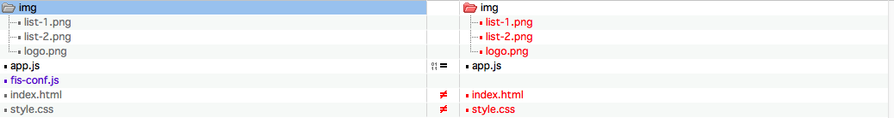
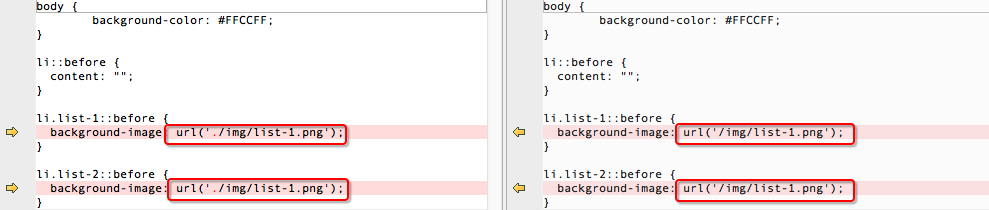
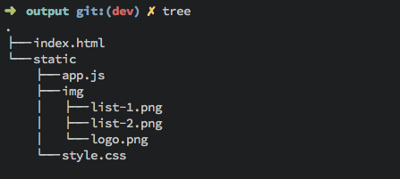
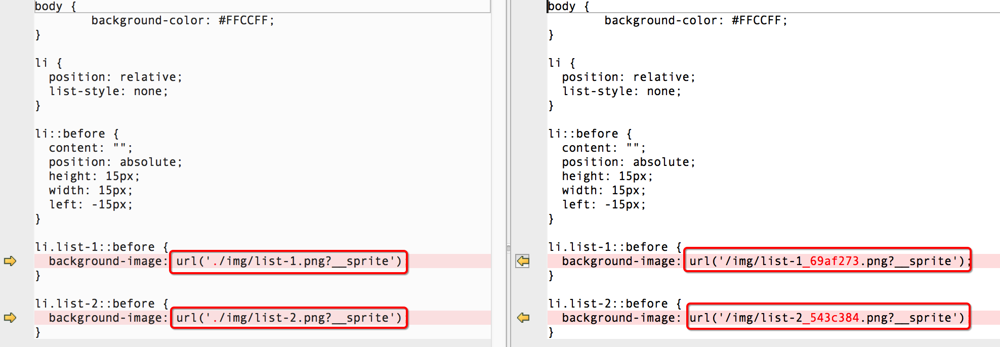

## 构建

*由 fis3-command-release 插件提供构建能力*

FIS3 的构建不会修改源码，而是会通过用户设置，将构建结果输出到指定的目录。

### 例子

在正式介绍 FIS3 功能之前，我们给定一个简单的例子，例子下载地址 [demo-simple](https://github.com/fex-team/fis3/blob/dev/doc/demo/demo-simple.tar.gz)

### 命令

进入**项目根目录**执行命令，进行构建。
> 项目根目录：FIS3 配置文件（默认`fis-conf.js`）所在的目录为项目根目录。

```bash
fis3 release -d <path>
```
- `<path>` 任意目录
- `fis3 release -h` 获取更多参数

#### 构建发布到项目目录的 `output` 目录下

```bash
fis3 release -d ./output
```

#### 构建发布到项目父级目录的 `dist` 子目录下 

```bash
fis3 release -d ../dist
```

#### 发布到其他盘 （Windows）

```bash
fis3 release -d D:\output
```

### 资源定位

我们在项目根目录执行命令 `fis3 release -d ../output` 发布到目录 `../output` 下。然后通过 diff 工具查看源码和构建结果的内容变化。

*文件变化*



- `index.html`、`style.css` 发生了变化

*index.html*


*style.css*



如上，构建过程中对资源 URI 进行了替换，替换成了绝对 URL。通俗点讲就是相对路径换成了绝对路径。

这是一个 FIS 的很重要的特性，**[资源定位][]**。

资源定位能力，可以有效的分离开发路径与部署路径之间的关系，工程师不再关心资源部署到线上之后去了哪里，变成了什么名字，这些都可以通过配置来指定。<font color="red">而工程师只需要使用相对路径来定位自己的开发资源即可</font>。这样的好处是 资源可以发布到任何静态资源服务器的任何路径上而不用担心线上运行时找不到它们，而且代码 具有很强的可移植性，甚至可以从一个产品线移植到另一个产品线而不用担心线上部署不一致的问题。

在默认不配置的情况下只是对资源相对路径修改成了绝对路径。通过配置文件可以轻松分离开发路径（源码路径）与部署路径。比如我们想让所有的静态资源构建后到 `static` 目录下。

```js
// 配置配置文件，注意，清空所有的配置，只留下以下代码即可。
fis.match('*.{png,js,css}', {
  release: '/static/$0'
});
```

同样构建到 `../output` 目录下看变化。

```bash
fis3 release -d ../output
```


以上示例只是更改部署路径，还可以给 `url` 添加 `CDN domain` 或者添加文件指纹（时间戳或者md5戳）。

**再次强调**，<font color="red">FIS3 的构建是不会对源码做修改的，而是构建产出到了另外一个目录，并且构建的结果才是用来上线使用的</font>。

可能有人会疑惑，修改成了绝对路径，本地如何调试开发？下一节介绍调试的方法。

### 配置文件

默认配置文件为 `fis-conf.js`，FIS3 编译的整个流程都是通过配置来控制的。FIS3 定义了一种类似 CSS 的[配置方式](../api/config.md)。固化了构建流程，以期让工程构建变得简单。

#### fis.match()

首先介绍设置规则的配置接口

```js
fis.match(selector, props);
```
- `selector` FIS3 把匹配文件路径的路径做为selector，匹配到的文件会分配给它设置的 `props`
- `props` 编译规则属性，包括文件属性和插件属性，[更多属性](../api/config-props.md)

我们修改例子的配置文件 `fis-conf.js`，添加以下内容

```js
fis.match('*.js', {
  useHash: false
});

fis.match('*.css', {
  useHash: false
});

fis.match('*.png', {
  useHash: false
});
```

**重要特性**

- 规则覆盖

  假设有两条规则 A 和 B，它俩同时命中了文件 `test.js`，如果 A 在 B 前面，B 的属性会覆盖 A 的同名属性。不同名属性追加到 *test.js* 的 File 对象上。

  ```js
  // A
  fis.match('*', {
    release: '/dist/$0'
  });

  // B
  fis.match('test.js', {
    useHash: true,
    release: '/dist/js/$0'
  })
  ```
  
  那么 **test.js** 分配到的属性
  
  ```js
  {
    useHash: true, // B
    release: '/dist/js/$0' // B
  }
  ```

#### fis.media()

`fis.media()` 接口提供多种状态功能，比如有些属性配置是开发阶段的，有些是上线时需要起作用的。

```js
fis.match('*', {
  useHash: false
});

fis.media('prod').match('*.js', {
  optimizer: fis.plugin('uglify-js')
});
```

```bash
fis3 release <media>
```
- `<media>` 配置的 media 值

```bash
fis3 release prod
```

发布读取 prod 对应的配置，js 进行压缩。

如上，fis.media() 可以使配置文件变为多份（多个状态，一个状态一份配置）。

```js
fis.media('rd').match('*', {
  deploy: fis.plugin('http-push', {
    receiver: 'http://remote-rd-host/receiver.php'
  })
});

fis.media('qa').match('*', {
  deploy: fis.plugin('http-push', {
    receiver: 'http://remote-qa-host/receiver.php'
  })
});
```

- `fis3 release rd` push 到 RD 的远端机器上
- `fis3 release qa` push 到 QA 的远端机器上

> media `dev` 已经被占用，默认情况下不加 `<media>` 参数时默认为 `dev`

[更多配置接口](../api/config-api.md)

我们执行 `fis3 inspect` 来查看文件命中属性的情况。`fis3 inspect` 是一个非常重要的命令，可以查看文件分配到的属性，这些属性决定了文件将如何被编译处理。

```bash
 ~ /app.js
 -- useHash false `*.js`   (0th)


 ~ /img/list-1.png
 -- useHash false `*.png`   (2th)


 ~ /img/list-2.png
 -- useHash false `*.png`   (2th)


 ~ /img/logo.png
 -- useHash false `*.png`   (2th)


 ~ /style.css
 -- useHash false `*.css`   (1th)


 ~ ::package
 -- empty
```

> `fis3 inspect <media>` 查看特定 media 的分配情况

**更多信息**

- [常用配置](../api/config-commonly-used.md)
- [配置属性](../api/config-props.md)

### 文件指纹

文件指纹，唯一标识一个文件。在开启强缓存的情况下，如果文件的 URL 不发生变化，无法刷新浏览器缓存。一般都需要通过一些手段来强刷缓存，一种方式是添加时间戳，每次上线更新文件，给这个资源文件的 URL 添加上时间戳。

```html

```

而 FIS3 选择的是添加 MD5 戳，直接修改文件的 URL，而不是在其后添加 `query`。

对 js、css、png 图片引用 URL 添加 md5 戳，配置如下；

```js
//清除其他配置，只剩下如下配置
fis.match('*.{js,css,png}', {
  useHash: true
});
```

构建到 `../output` 目录下看变化。

```bash
fis3 release -d ../output
```

*文件变化*


- 构建出的文件携带了  md5 戳

*文件变化*


- 对应 url 也带上了 md5 戳

### 压缩资源

为了减少资源网络传输的大小，通过压缩器对 js、css、图片进行压缩是一直以来前端工程优化的选择。在 FIS3 中这个过程非常简单，通过给文件配置压缩器即可。

```js
// 清除其他配置，只保留如下配置
fis.match('*.js', {
  // fis-optimizer-uglify-js 插件进行压缩，已内置
  optimizer: fis.plugin('uglify-js')
});

fis.match('*.css', {
  // fis-optimizer-clean-css 插件进行压缩，已内置
  optimizer: fis.plugin('clean-css')
});

fis.match('*.png', {
  // fis-optimizer-png-compressor 插件进行压缩，已内置
  optimizer: fis.plugin('png-compressor')
});
```

构建到 `../output` 目录下看变化。

```bash
fis3 release -d ../output
```

查看 `../output` 目录下已经被压缩过的结果。

### CssSprite图片合并

压缩了静态资源，我们还可以对图片进行合并，来减少请求数量。

FIS3 提供了比较简易、使用方便的图片合并工具。通过配置即可调用此工具并对资源进行合并。

FIS3 构建会对 CSS 中，路径带 `?__sprite` 的图片进行合并。为了节省编译的时间，分配到 `useSprite: true` 的 CSS 文件才会被处理。

> 默认情况下，对打包 css 文件启动图片合并功能。

```css
li.list-1::before {
  background-image: url('./img/list-1.png?__sprite');
}

li.list-2::before {
  background-image: url('./img/list-2.png?__sprite');
}
```

```js
// 启用 fis-spriter-csssprites 插件
fis.match('::package', {
  spriter: fis.plugin('csssprites')
})

// 对 CSS 进行图片合并
fis.match('*.css', {
  // 给匹配到的文件分配属性 `useSprite`
  useSprite: true
});
```

- CssSprites 详细配置参见 [fis-spriter-csssprites](https://github.com/fex-team/fis-spriter-csssprites)

### 功能组合

我们学习了如何用 FIS3 做压缩、文件指纹、图片合并、资源定位，现在把这些功能组合起来，配置文件如下；

```js
// 加 md5
fis.match('*.{js,css,png}', {
  useHash: true
});

// 启用 fis-spriter-csssprites 插件
fis.match('::package', {
  spriter: fis.plugin('csssprites')
})

// 对 CSS 进行图片合并
fis.match('*.css', {
  // 给匹配到的文件分配属性 `useSprite`
  useSprite: true
});

fis.match('*.js', {
  // fis-optimizer-uglify-js 插件进行压缩，已内置
  optimizer: fis.plugin('uglify-js')
});

fis.match('*.css', {
  // fis-optimizer-clean-css 插件进行压缩，已内置
  optimizer: fis.plugin('clean-css')
});

fis.match('*.png', {
  // fis-optimizer-png-compressor 插件进行压缩，已内置
  optimizer: fis.plugin('png-compressor')
});
```

- `fis3 release` 时添加 md5、静态资源压缩、css 文件引用图片进行合并

可能有时候开发的时候不需要压缩、合并图片、也不需要 hash。那么给上面配置追加如下配置；

```js
fis.media('debug').match('*.{js,css,png}', {
  useHash: false,
  useSprite: false,
  optimizer: null
})
```

- `fis3 release debug` 启用 media `debug` 的配置，覆盖上面的配置，把诸多功能关掉。

[资源定位]: ../user-dev/uri.md
