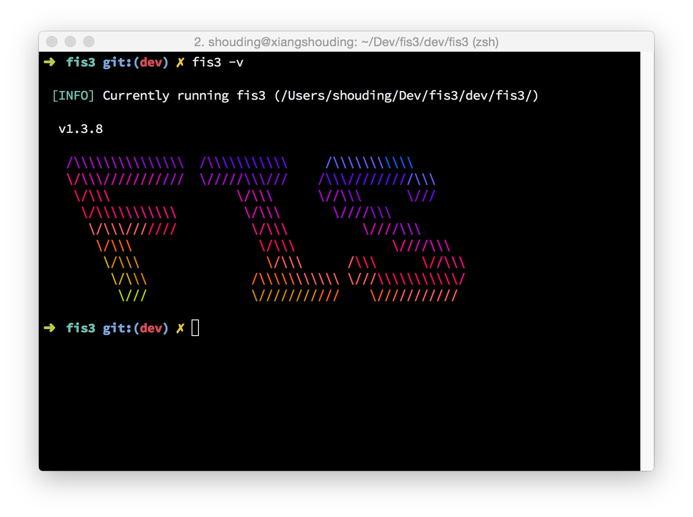

## 安装 node 和 npm

具体安装流程请参考 http://nodejs.org

## 安装 fis3

```bash
$ npm install -g fis3
```
> Windows 用户打开 CMD 执行，类 Unix 系统打开任意终端执行；以下不再赘述

当安装完成后，在终端执行；

```bash
$ fis3 -v
```

如果安装成功，会得到相应命令执行的结果；


