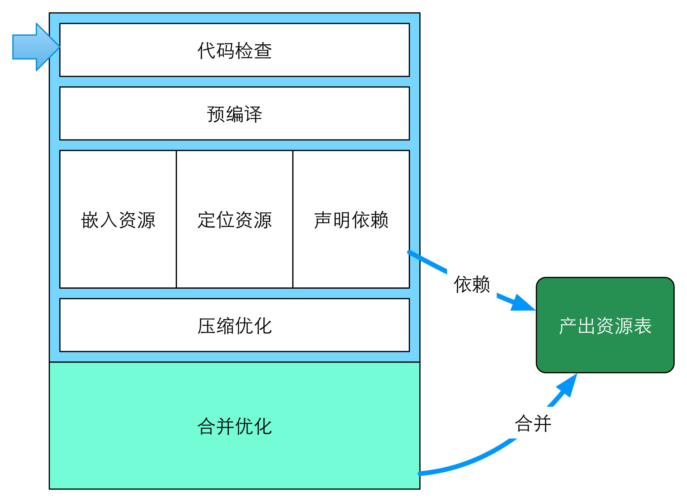

## 代码校验



一致的代码格式规范利于代码**维护性**的提高，也是工程构建工具需要注重考虑的功能。

FIS3 通过**不同校验插件**来实现对不同语言的校验。

### 对 JS 进行校验

```js
fis.match('*.js', {
  // 需要执行 npm install -g fis-lint-jshint 安装此插件
  lint: fis.plugin('jshint', {
    //ignored some files 
    //ignored : 'static/libs/**.js', 
    ignored : [ 'static/libs/**.js', /jquery\.js$/i ],
 
    //using Chinese reporter 
    i18n : 'zh-CN',
 
    //jshint options 
    camelcase : true,
    curly : true,
    eqeqeq : true,
    forin : true,
    immed : true,
    latedef : true,
    newcap : true,
    noarg : true,
    noempty : true,
    node : true
  })
});
```

### 对 CSS 进行校验

```js
fis.match('*.css', {
  // 需要执行 npm install -g fis-lint-csslint 安装此插件
  // https://github.com/stubbornella/csslint/wiki/Rules
  lint: fis.plugin('csslint', {
    /**
     * 报告为“WARNING”的规则ID列表，支持数组或以“,”分隔的字符串
     */
    warnings : ["rule1", "rule2", ...],
 
    /**
     * 报告为“ERROR”的规则ID列表，支持数组或以“,”分隔的字符串
     */
    errors   : ["rule1", "rule2", ...],
 
    /**
     * 若ie值为false，则忽略所有与IE兼容性相关的校验规则
     */
    ie       : false,
 
    /**
     * 要忽略的规则ID列表，支持数组或以“,”分隔的字符串
     */
    ignore   : ["rule1", "rule2", ...]
  })
});
```
