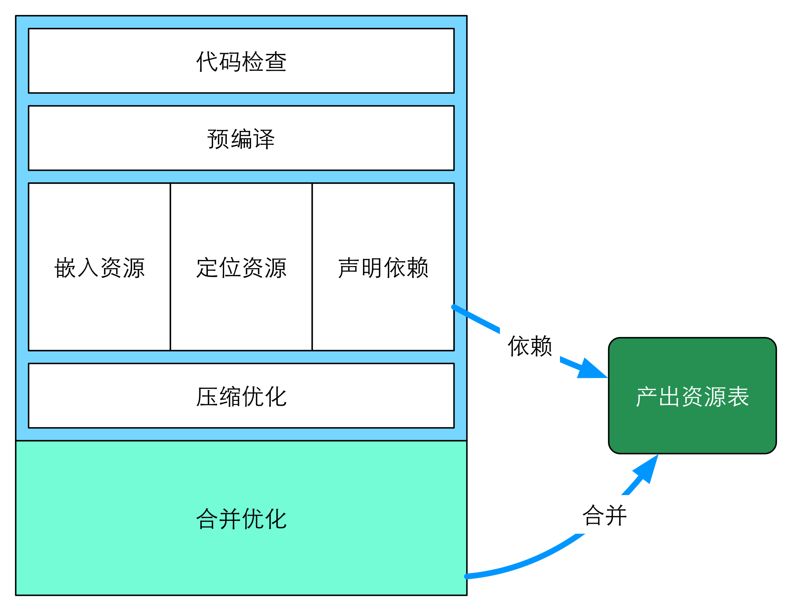

FIS3 中提出的某些概念可能是在其他构建工具中不曾遇到过的，可能需要你花费几分钟时间看完这些概念解释。

FIS3 的每一个编译流程都是为前端工程量身定做的，如上图，上图表示了 FIS3 构建的文件处理流程也表述了其为前端工程量身定做的几块功能。包含[代码格式检查][]、[预编译][]、[三种语言能力][]、[压缩优化][]、[合并优化][]几个大块。三种语言能力包括[嵌入资源][]、[定位资源][]、[声明依赖][]三种能力。

[声明依赖][]、[合并优化][]两块获得资源之间的依赖及合并信息产出[资源列表][]。

> 这些功能都可以被扩展来应对不同的模块化开发及不同的开发模式。

接下来分别描述这些功能解决什么工程问题。

[代码格式检查]: ./lint.md
[预编译]: ./parser.md
[三种语言能力]: ./ext-lang.md
[嵌入资源]: ./inline.md
[定位资源]: ./uri.md
[声明依赖]: ./require.md
[压缩优化]: ./optimizer.md
[合并优化]: ./combine.md
[资源列表]: ./map.md
