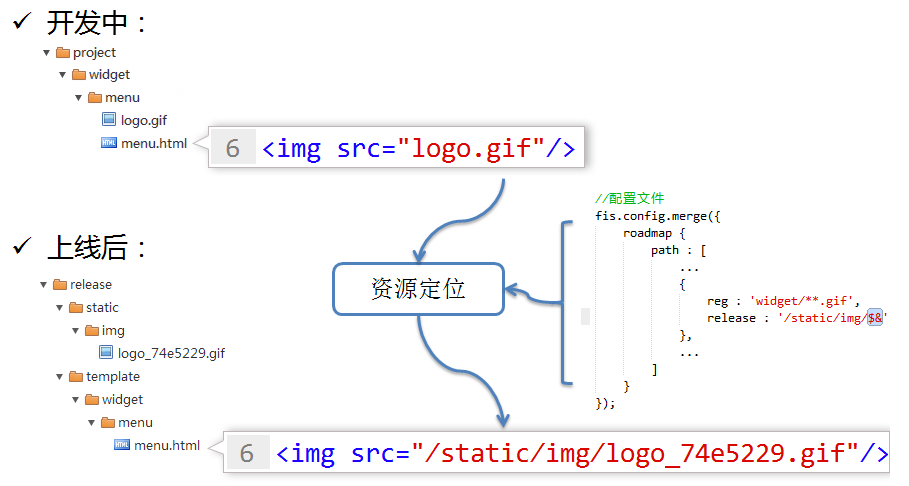

我们知道，单凭没有刻度的直尺和圆规就可以实现很多作图操作，那么，解决前端领域开发问题的“尺”与“规”是什么呢？F.I.S团队经过不断的实践和总结发现前端编译工具只须处理三件事，即可满足几乎所有的初等前端开发问题，这三件事就是三种语言能力：

* **资源定位**：编译中将开发时所使用的资源定位标识转换为上线后的值；
* **内容嵌入**：编译中文本文件的内容或者二进制文件（如图片）的base64编码嵌入到另一个文件中；
* **依赖声明**：编译中识别文件内标记的对其他资源的依赖声明；

> 下图为资源定位能力示意图

有了这三种语言能力，你的团队前端工业化水平将有很大的提升。F.I.S编译工具在前端三种领域语言中分别实现了这三种能力的扩展：

* 在html中：[定位资源](https://github.com/fis-dev/fis/wiki/在html中定位资源)、[嵌入资源](https://github.com/fis-dev/fis/wiki/在html中嵌入资源)、[声明依赖](https://github.com/fis-dev/fis/wiki/在html中声明依赖)
* 在js中：[定位资源](https://github.com/fis-dev/fis/wiki/在js中定位资源)、[嵌入资源](https://github.com/fis-dev/fis/wiki/在js中嵌入资源)、[声明依赖](https://github.com/fis-dev/fis/wiki/在js中声明依赖)
* 在css中：[定位资源](https://github.com/fis-dev/fis/wiki/在css中定位资源)、[嵌入资源](https://github.com/fis-dev/fis/wiki/在css中嵌入资源)、[声明依赖](https://github.com/fis-dev/fis/wiki/在css中声明依赖)