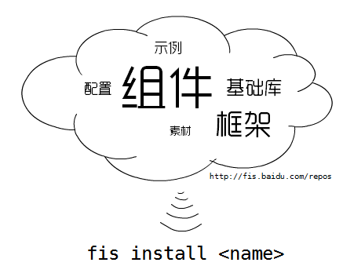

### 前端开发资源聚合

F.I.S将业界众多优秀的前端资源 **逐版本** 收集并发布到fis的代码仓库中，使用fis提供的 [fis install](https://github.com/fis-dev/fis/wiki/%E5%BF%AB%E9%80%9F%E4%B8%8A%E6%89%8B#fis-install-name) 命令，工程师将非常方便的通过fis获取它们。

### 前端开发工具聚合

F.I.S的编译平台是完全插件化的，非常容易对其 **编译打包过程** 或 **命令行功能** 进行扩展。此外，将less、coffee-script等前端语言处理工具集成到F.I.S之后，F.I.S仍然会对其处理后的结果进行语言能力扩展，这意味着在F.I.S的帮助下，用户可以轻松混合使用任何喜欢的语言进行前端开发，而不用担心彼此配合的问题！

F.I.S团队现已实现了许多优秀的插件，相关信息请阅读：[编译过程运行原理](https://github.com/fis-dev/fis/wiki/运行原理)，[插件调用机制](https://github.com/fis-dev/fis/wiki/插件调用机制)，[插件扩展点列表](https://github.com/fis-dev/fis/wiki/插件扩展点列表)
