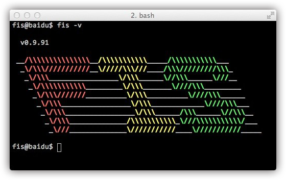

> F.I.S所提供的集成解决方案依托于一套灵活高效的 [编译工具](https://github.com/fis-dev/fis)，F.I.S借助该编译平台对前端开发资源进行整合。接触F.I.S，可以从该平台入手。

### 安装F.I.S编译工具 

    npm install -g fis

fis的 **自动化/辅助开发工具** 被发布为一套 [npm包](https://npmjs.org/package/fis)，它对环境的要求是：

* 操作系统：任何能安装 [nodejs](http://nodejs.org/) 的操作系统
* node版本：>= v0.8.0
* jre版本：>= v1.5.0 _【如果不需要本地调试服务器，可以忽略java环境要求】_
* php-cgi版本：>= v5.0.0 _【如果不需要本地调试服务器，可以忽略php-cgi环境要求】_

安装好fis之后，执行 **fis -v**，如果看到下面信息，恭喜，你已拥有百度前端团队倾情打造的前端集成解决方案的开发调试环境啦！

